# VideoDesk - Comprehensive Features Documentation

## Table of Contents
1. [Overview](#overview)
2. [User Roles & Permissions](#user-roles--permissions)
3. [Core Features](#core-features)
4. [WebRTC Video Communication](#webrtc-video-communication)
5. [AI-Powered Damp & Mould Analyser](#ai-powered-damp--mould-analyser)
6. [Dashboard Features](#dashboard-features)
7. [File Upload & Sharing](#file-upload--sharing)
8. [Chat & Messaging System](#chat--messaging-system)
9. [Support & Feedback System](#support--feedback-system)
10. [Advanced Features](#advanced-features)
11. [Technical Architecture](#technical-architecture)

## Overview

VideoDesk is a comprehensive real-time video collaboration platform designed for property management. The platform combines WebRTC technology to provide a complete solution for property inspections, remote support, and collaborative work, with additional AI-powered damp and mould analysis capabilities.

### Key Capabilities
- Real-time video calling with screen sharing
- Multi-role user management system
- File upload and sharing capabilities
- Real-time chat and messaging
- Support ticket management
- Comprehensive dashboard analytics
- Advanced drawing and annotation tools
- Real-time notifications system
- Camera controls and mobile features
- Special notes and feedback collection
- Demo meeting and callback request system
- AI-powered damp and mould detection

## User Roles & Permissions

### 1. Super Admin
**Access Level**: Full system access
**Dashboard**: `/dashboard/superadmin`
**Purpose**: System-wide administration and oversight of the entire VideoDesk platform

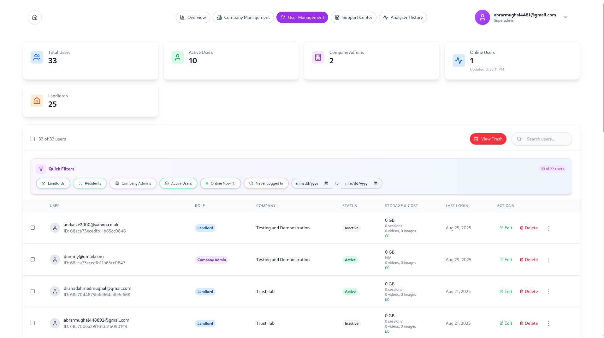

<small>*Super Admin Dashboard Screen, where system-wide administration and user management is handled*</small>

**Capabilities**:
- Complete user management (create, edit, suspend, delete users)
- Company management and oversight
- System-wide analytics and monitoring
- Support ticket management and resolution
- Analyser history and usage tracking
- System settings configuration
- AI Analyser access for all users
- Access to all features across all companies

**Key Features** (Navigation buttons across top of Super Admin Screen):
- User Management Section
- Company Management Section
- Support Ticket Management
- Analyser History Section
- System Overview with real-time statistics

### 2. Company Admin
**Access Level**: Company-specific management
**Dashboard**: `/dashboard/companyadmin`
**Purpose**: Manage and oversee users and operations within their specific company

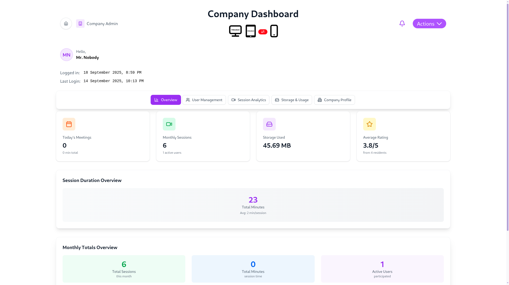

<small>*Company Admin Dashboard Interface, showing comprehensive metrics, session analytics, storage usage, and user management capabilities*</small>

**Capabilities**:
- Manage users within their company
- View company-specific analytics
- Invite new users to their company
- Manage company settings
- AI Analyser access
- Access to company-specific features

**Key Features**:
- User Management (company users only)
- Company Profile Management
- Meeting Analytics
- Storage Usage Monitoring
- Activity History

### 3. Landlord
**Access Level**: Property management focused
**Dashboard**: `/dashboard`

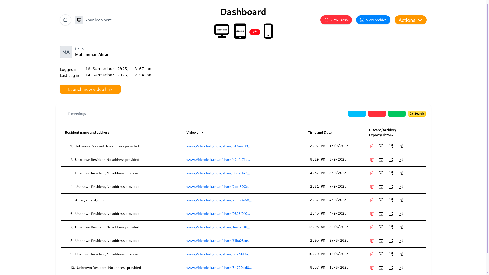

<small>*Landlord Dashboard Screen, where video meetings are saved and property management features are accessed*</small>

**Capabilities**:
- **Session Management**: Generate session links for residents

  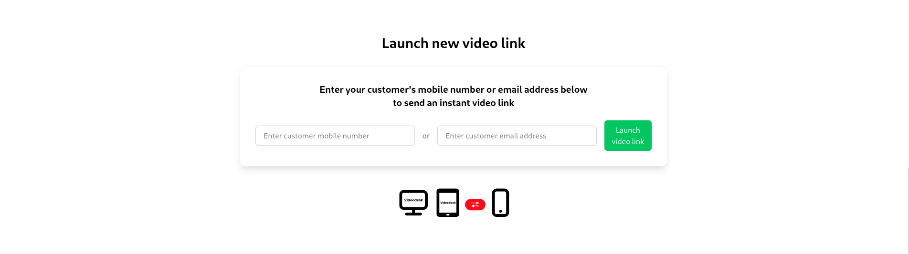

  <small>*Video Link Generation Interface, where landlords create session links for residents to join video calls*</small>
- **Video Communication**: Conduct video sessions with residents
- **Room Control**: Full landlord control in video rooms (pointer events, screen sharing)
- **Recording & Screenshots**: Take video recordings and screenshots during sessions
- **Session Sharing**: Share completed sessions with others
- **Print Functionality**: Print session reports and documentation
- **Access Tracking**: View who has accessed sessions and when
- **Message Management**: Amend and manage messages *(Access via dashboard action button dropdown)*
- **Team Collaboration**: Invite co-workers to sessions *(Access via dashboard action button dropdown)*
- **Profile Management**: Set profile images and company logos *(Access via dashboard action button dropdown)*
- **Property Inspections**: Create and manage property inspections

**Dashboard Action Button**: Located in the top right corner of the dashboard, this action button opens a dropdown menu providing quick access to the above features. Users should look for this button to access Message Management, Team Collaboration, and Profile Management tools.

### 4. Resident
**Access Level**: Basic user access
**Dashboard**: `/dashboard`
**Purpose**: Property residents who need to upload content, generate access codes, and participate in video sessions with landlords

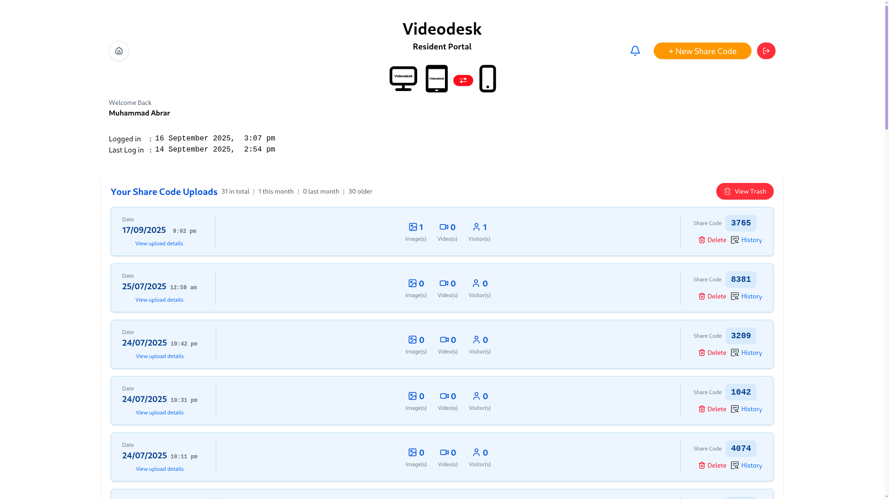

<small>*Resident Dashboard Interface, where residents can view their share code uploads, manage content, and track visitor statistics*</small>

**Capabilities**:
- **File Upload**: Upload property images and videos
- **AI Analyser Access**: Use damp and mould analyser
- **Share Code Generation**: Create access codes for their uploads
- **Video Communication**: Participate in video calls with landlords
- **Content Sharing**: Share content via generated access codes

**New Share Code Process**:
- **Upload Creation**: Click "+ New Share Code" button to create new uploads
- **File Selection**: Upload property images and videos (max 6 images, 2 videos)
- **Share Code Generation**: System automatically generates unique 4-digit share code
- **Code Sharing**: Receive share code to provide to landlords
- **Landlord Access**: Landlords can use the share code to view uploaded content
- **Visitor Tracking**: Monitor who has accessed the shared content

### Access Code System

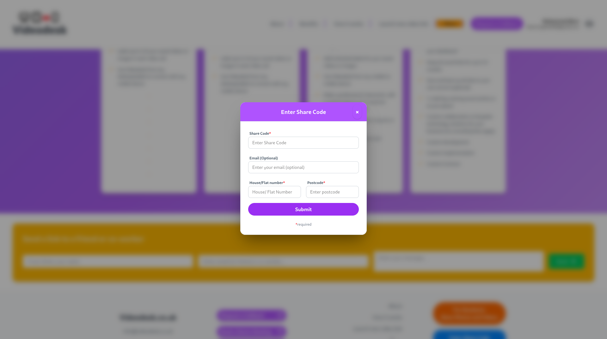

<small>*Access 'Share Code', where landlord enter the share code provided from the resident and also put his details to access the shared uploads.*</small>

**Location**: Landing page bottom right corner - blue button

**Features**:
- **Unique Code Generation**: Automatic access code creation
- **Time-Limited Access**: 15-minute timeout for guest users
- **Role-Based Access**: Different permissions based on user role
- **Secure Sharing**: Codes can be shared via URL parameters
- **Content Association**: Codes linked to specific uploads or rooms

## Core Features

### 1. Advanced Drawing & Annotation Tools

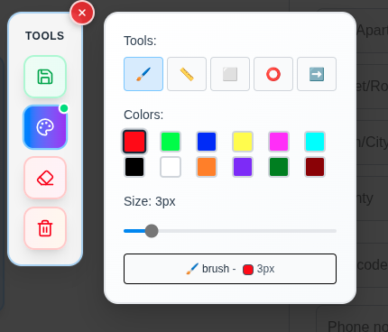

<small>*Drawing and Annotation Tools Interface, where users can draw, highlight, and annotate during video calls*</small>

**Location**: Available in video calling interface during live sessions - specifically when screenshot is in maximized state

**Technology**: HTML5 Canvas API

**Purpose**: Enhanced collaboration and property inspection documentation

**Features**:
- **Multiple Drawing Tools**: Brush, Line, Rectangle, Circle, Arrow
- **Color Palette**: 12 different colors for annotations
- **Variable Line Width**: Adjustable brush sizes (1-10px)
- **Real-time Drawing**: Live drawing synchronization between users
- **Screenshot Integration**: Draw directly on captured screenshots
- **Layer Management**: Background images with drawing overlays
- **Undo/Redo**: Drawing history management
- **Export Capabilities**: Save annotated images

**Code Implementation**:

```javascript
// Drawing tools configuration
const tools = [
  { name: 'brush', icon: '🖌️', title: 'Brush - Free drawing' },
  { name: 'line', icon: '📏', title: 'Line - Draw straight lines' },
  { name: 'rectangle', icon: '⬜', title: 'Rectangle - Draw rectangular shapes' },
  { name: 'circle', icon: '⭕', title: 'Circle - Draw circular shapes' },
  { name: 'arrow', icon: '➡️', title: 'Arrow - Draw directional arrows' }
];

const colors = [
  '#ff0000', '#00ff00', '#0000ff', '#ffff00', 
  '#ff00ff', '#00ffff', '#000000', '#ffffff',
  '#ff8000', '#8000ff', '#008000', '#800000'
];

// Drawing functions
const startDrawing = (e) => {
  setIsDrawing(true);
  const { x, y } = getMousePos(canvas, e);
  startPoints.current = { x, y };
};

const draw = (e) => {
  if (!isDrawing) return;
  
  const { x, y } = getMousePos(canvas, e);
  const ctx = canvas.getContext('2d');
  
  ctx.strokeStyle = selectedColor;
  ctx.lineWidth = lineWidth;
  ctx.lineCap = 'round';
  
  if (selectedTool === 'brush') {
    ctx.lineTo(x, y);
    ctx.stroke();
  }
};
```

**Drawing Tools Available**:
- 🖌️ **Brush**: Free-form drawing
- 📏 **Line**: Straight line drawing between points
- ⬜ **Rectangle**: Rectangular shape drawing
- ⭕ **Circle**: Circular shape drawing from center
- ➡️ **Arrow**: Directional arrow drawing

**Use Cases**:
- Property defect highlighting
- Inspection area marking
- Repair instruction annotation
- Visual communication during video calls

### 2. Real-time Notifications System

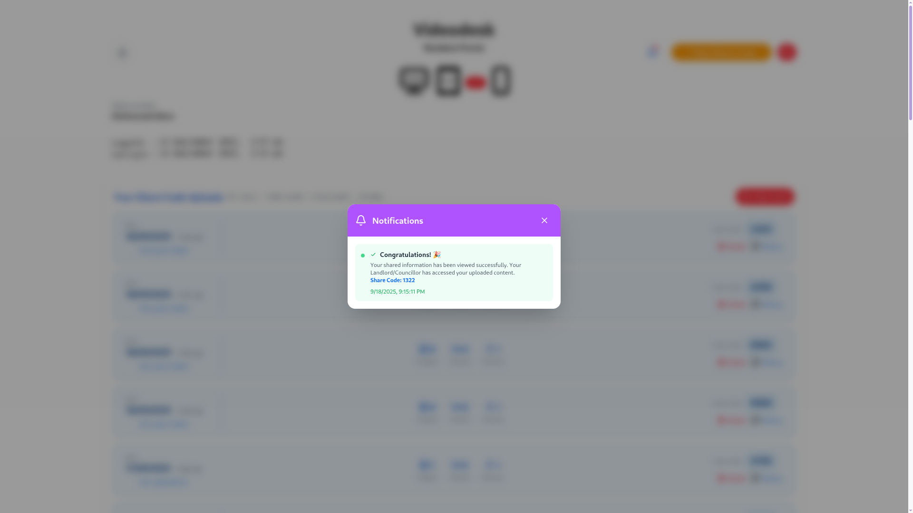

<small>*Real-time Notifications Interface, showing success notification when landlord accesses shared content with share code and timestamp*</small>

**Location**: Accessible via notification bell icon in the top navigation bar of resident dashboard

**Technology**: Socket.IO WebSocket connections

**Purpose**: Real-time notifications for residents when their shared content is accessed by landlords, providing instant feedback on content engagement and access tracking

**Features**:
- **Real-time Alerts**: Instant notification delivery
- **Access Code Tracking**: Notifications when shared content is viewed
- **Toast Notifications**: In-app popup notifications
- **Notification History**: Persistent notification storage
- **Read/Unread Status**: Notification state management
- **Auto-reconnection**: Automatic WebSocket reconnection
- **Local Storage**: Offline notification caching

**Code Implementation**:

```javascript
// Notification hook implementation
const useNotifications = (userEmail) => {
  const [socket, setSocket] = useState(null);
  const [hasNotifications, setHasNotifications] = useState(false);
  const [notificationData, setNotificationData] = useState(null);

  useEffect(() => {
    if (!userEmail) return;

    const socketRef = io(process.env.NEXT_PUBLIC_SOCKET_URL);
    
    socketRef.emit('join-notification-room', userEmail);
    
    socketRef.on('new-notification', (notification) => {
      setNotificationData(prev => [notification, ...(prev || [])]);
      setHasNotifications(true);
      
      toast.success('New notification!', {
        description: `Your share code ${notification.accessCode} has been viewed!`
      });
    });

    setSocket(socketRef);
    return () => socketRef.disconnect();
  }, [userEmail]);

  return { socket, hasNotifications, notificationData };
};
```


### 3. Camera Controls & Mobile Features


<small>*Mobile Video Interface with Camera Controls, showing live video call with zoom, flash, and recording controls*</small>

**Location**: Available in video calling interface during live sessions

**Technology**: WebRTC MediaDevices API

**Purpose**: Enhanced mobile video experience and remote camera control

**Features**:
- **Remote Camera Control**: Landlords can control resident's camera
- **Zoom Controls**: Digital zoom in/out functionality (ZoomIn, ZoomOut icons)
- **Torch Control**: Flash/torch toggle for mobile devices
- **Mobile Optimization**: Touch-optimized controls
- **Device Detection**: Automatic mobile/desktop feature detection
- **Permission Management**: Automatic camera permission handling

**Code Implementation**:

```javascript
// Camera zoom control
const handleCameraZoom = async (direction) => {
  if (localStream && localStream.getVideoTracks().length > 0) {
    const videoTrack = localStream.getVideoTracks()[0];
    const capabilities = videoTrack.getCapabilities();
    
    if (capabilities.zoom) {
      const settings = videoTrack.getSettings();
      const currentZoom = settings.zoom || 1;
      
      let newZoom = direction === 'in' 
        ? Math.min(currentZoom * 1.2, capabilities.zoom.max)
        : Math.max(currentZoom / 1.2, capabilities.zoom.min);
      
      await videoTrack.applyConstraints({
        advanced: [{ zoom: newZoom }]
      });
    }
  }
};

// Camera torch control
const handleCameraTorch = async (enabled) => {
  if (localStream && localStream.getVideoTracks().length > 0) {
    const videoTrack = localStream.getVideoTracks()[0];
    const capabilities = videoTrack.getCapabilities();
    
    if (capabilities.torch) {
      await videoTrack.applyConstraints({
        advanced: [{ torch: enabled }]
      });
    }
  }
};
```

**Camera Controls**:
- **Zoom In/Out**: 1x to 3x digital zoom
- **Torch Toggle**: Flash on/off for mobile devices
- **Focus Control**: Manual focus adjustment
- **Pan Controls**: Camera positioning
- **Reset Function**: Return to default settings

### 4. Special Notes 

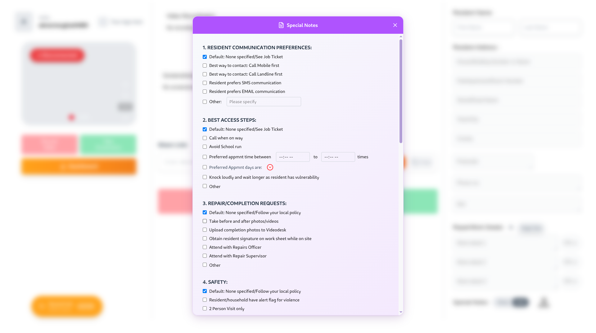

<small>*Special Notes Modal Interface, where users can set communication preferences, access instructions, repair requests, and safety alerts for property visits*</small>

**Location**: Available in video calling interface and property upload forms

**Technology**: Structured form system with JSON storage

**Purpose**: Comprehensive property inspection documentation

**Features**:
- **Structured Notes**: Categorized special notes system
- **Communication Preferences**: Resident contact preferences
- **Access Instructions**: Property access guidelines
- **Safety Alerts**: Risk assessment and safety flags
- **Vulnerability Tracking**: Household vulnerability documentation
- **Repair Requests**: Work completion requirements
- **Custom Fields**: Additional note categories

**Special Notes Categories**:
- **Communication Preferences**: Contact methods and timing
- **Access Instructions**: Property entry procedures
- **Safety Alerts**: Risk flags and safety requirements
- **Vulnerability Information**: Household vulnerability tracking
- **Repair Requirements**: Work completion specifications

### 5. Demo Meeting & Callback System

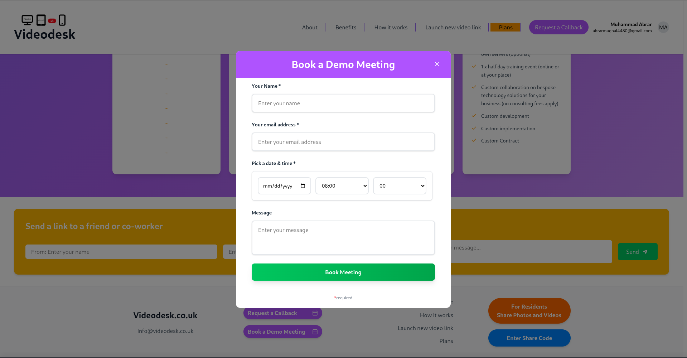

<small>*Demo Meeting Booking Modal, where users can schedule product demonstrations with date and time selection*</small>

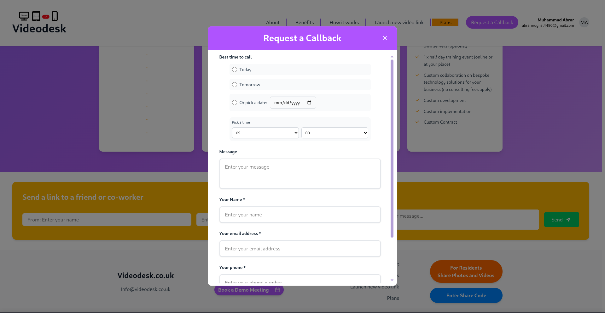

<small>*Callback Request Modal, where users can request phone callbacks with preferred time and contact details*</small>

**Location**: Landing page footer - purple color buttons

**Technology**: Form-based request system with backend processing

**Purpose**: Lead generation and customer engagement

**Features**:
- **Demo Meeting Booking**: Schedule product demonstrations
- **Callback Requests**: Request phone callbacks
- **Time Slot Selection**: Flexible scheduling options
- **Form Validation**: Complete form validation
- **Email Notifications**: Automatic confirmation emails
- **Admin Management**: Backend request management
- **Status Tracking**: Request status monitoring

**Request Types**:
- **Demo Meetings**: Product demonstration scheduling
- **Callback Requests**: Phone callback scheduling
- **Custom Time Slots**: Flexible appointment times
- **Message Attachments**: Additional request details

**Training Video**: [Watch the training video for this feature](https://drive.google.com/file/d/1UYVX7P5_QDluYAtcxuEi7zvcqJlYCdbT/view)

### 6. Real-time Pointer Tracking

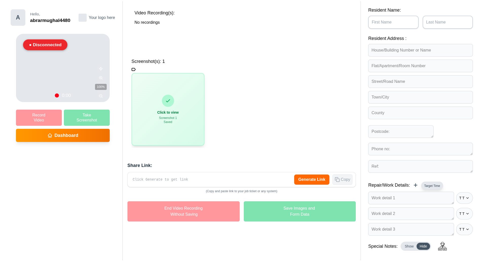

<small>*Video Calling Interface with Pointer Tracking, where landlords can guide residents during property inspections*</small>

**Technology**: WebSocket + Canvas API

**Purpose**: Enhanced remote support and collaboration

**Features**:
- **Landlord-Only Control**: Only landlords can send pointer events in video sessions
- **Immediate Response**: No delay - indicators appear instantly
- **Live Tracking**: Real-time pointer movement following
- **Visual Indicators**:
  - Red circle: Immediate click/touch indicator
  - Blue circle with green dot: Live tracking movement
  - Smooth animations for better UX
- **Cross-Device Compatibility**: Works on desktop and mobile
- **Normalized Coordinates**: Percentage-based positioning for different screen sizes
- **Room Admin Access**: Landlords have admin control in video rooms

**Use Cases**:
- Property inspection guidance by landlords
- Remote support during video sessions
- Training and demonstrations
- Collaborative property assessments

## WebRTC Video Communication


<small>*Main Video Calling Interface, where real-time video communication and screen sharing takes place*</small>

### 1. Video Calling
**Technology**: WebRTC PeerConnection API
**STUN/TURN Servers**: Configured for NAT traversal

**Features**:
- **Peer-to-Peer Connection**: Direct video/audio streaming
- **Automatic Negotiation**: Offer/Answer/ICE candidate exchange
- **Connection Management**: Automatic reconnection on failure
- **Mobile Support**: Touch-optimized controls
- **Camera Controls**: Zoom, torch (mobile), focus controls

**Technical Implementation**:

```javascript
// WebRTC Peer Connection Setup
const peerConfig = {
    iceServers: [
        { urls: 'stun:stun.l.google.com:19302' },
        { urls: 'turn:your-turn-server.com:3478', username: 'user', credential: 'pass' }
    ]
}

const createRTCPeerConnection = () => {
    const peerConnection = new RTCPeerConnection(peerConfig);
    peerConnection.onicecandidate = (event) => {
        if (event.candidate) {
            socket.emit('ice-candidate', event.candidate, roomId);
        }
    };
    return peerConnection;
};

// Screen sharing
const startScreenShare = async () => {
    const stream = await navigator.mediaDevices.getDisplayMedia({
        video: { width: 1920, height: 1080, cursor: 'always' },
        audio: false
    });
    stream.getTracks().forEach(track => peerConnection.addTrack(track, stream));
};
```

### 2. Screen Sharing
**Technology**: getDisplayMedia API
**Features**:
- **Browser Surface Sharing**: Share entire browser content
- **Cursor Tracking**: Always show cursor position
- **High Resolution**: Up to 1920x1080 at 30fps
- **Audio Support**: Optional audio sharing
- **Permission Management**: Automatic permission handling

### 3. Observer Mode

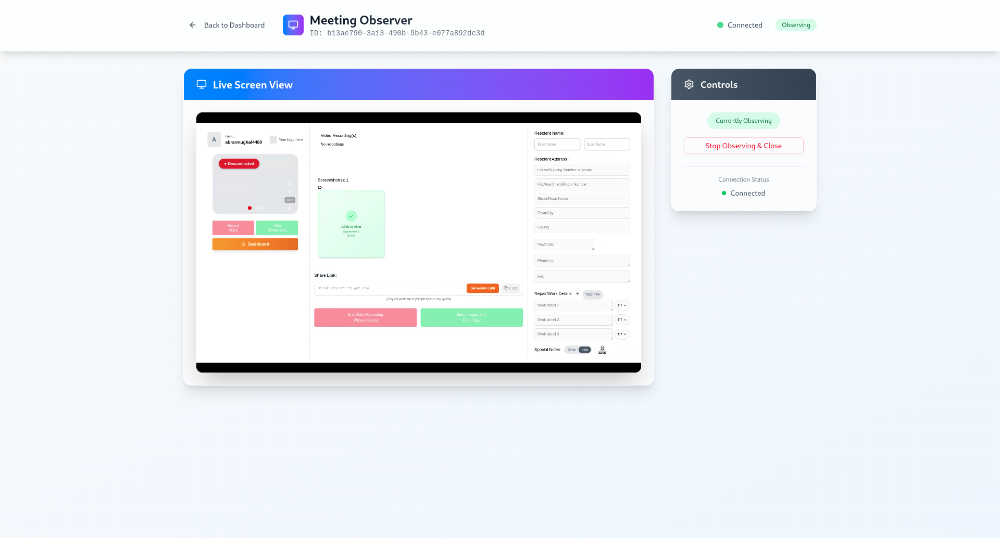

<small>*Observer Mode Interface, where third-party users can watch video calls without participating*</small>

**Location**: Company Admin Panel → User Management → Action buttons (Monitor icon) for users currently in video rooms

**Purpose**: Third-party observation of video calls
**Features**:
- **Read-Only Access**: Observers cannot control the call
- **Real-time Viewing**: Live video stream access
- **Meeting Integration**: Link generation for observers
- **Session Recording**: Optional call recording capabilities

### 4. Recording & Screenshots
**Features**:
- **Screenshot Capture**: Instant image capture during calls
- **Video Recording**: Full call recording with MediaRecorder API
- **Cloud Storage**: Automatic upload to S3-compatible storage
- **Duplicate Prevention**: Hash-based duplicate detection
- **Progress Tracking**: Real-time upload progress

### 5. Resend Video Link Feature

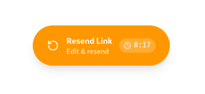

<small>*Resend Video Link Button, showing the orange resend button with timer in the bottom right corner of the video screen*</small>

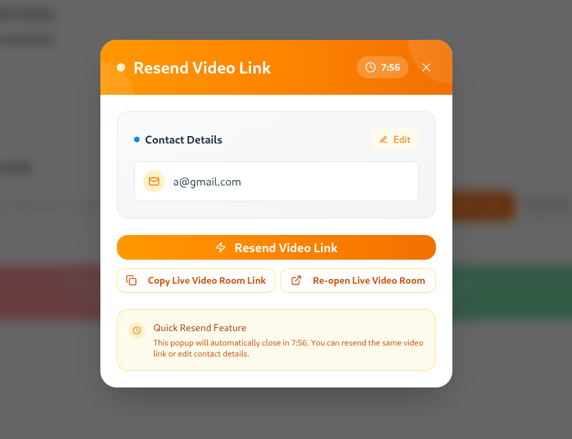

<small>*Resend Video Link Popup, where users can edit contact details and resend video links with a 10-minute timer*</small>

**Location**: Right bottom corner of video screen (remains visible even when video screen is closed)

**Technology**: Drag and drop functionality with 2-second hold activation

**Purpose**: Allow users to resend video links when delivery fails or contact details are incorrect

**Features**:
- **Drag & Drop Activation**: Hold button for 2 seconds to activate drag functionality
- **Persistent Visibility**: Button remains visible even when video screen is closed
- **10-Minute Timer**: Button automatically hides after 10 minutes
- **Contact Editing**: Edit email and contact number details before resending
- **Email Correction**: Modify email address if incorrectly entered
- **Phone Number Update**: Change contact number if needed
- **Multiple Actions**: Resend link, copy room link, or re-open video room
- **Auto-Close Timer**: Popup automatically closes with countdown display
- **Quick Resend**: One-click resend with same contact details

**Use Cases**:
- Resend video link when email delivery fails
- Correct incorrect contact information
- Provide alternative access methods
- Emergency link sharing during active sessions

## AI-Powered Damp & Mould Analyser

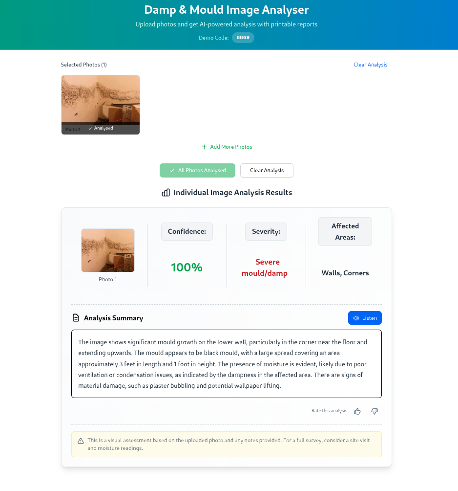

<small>*AI Damp & Mould Analyser Interface, where users upload property images for automated damp and mould detection*</small>

### 1. Image Analysis Engine
**Technology**: OpenAI GPT-4 Vision API
**Purpose**: Automated damp and mould detection in property images

**Analysis Features**:
- **Real-time Photo Analysis**: Instant image processing
- **AI-Powered Detection**: Advanced computer vision algorithms
- **Mould Growth Prediction**: Predictive analysis models
- **Prevention Recommendations**: Actionable advice generation
- **24/7 Automated Reporting**: Continuous monitoring capability

**Technical Implementation**:

```javascript
// AI Analysis API Route
export async function POST(request) {
  const { image } = await request.json();
  const openai = new OpenAI({ apiKey: process.env.OPENAI_API_KEY });

  const response = await openai.chat.completions.create({
    model: "gpt-4o-mini",
    messages: [{
      role: "system", 
      content: "You are a UK building surveyor expert in damp, mould, and condensation analysis. Provide detailed analysis with exact locations and severity assessment."
    }, {
      role: "user",
      content: [
        { type: "text", text: "Analyse this image for damp, mould, and condensation issues." },
        { type: "image_url", image_url: { url: image, detail: "high" } }
      ]
    }],
    max_tokens: 1000,
    temperature: 0.1
  });

  return Response.json({
    success: true,
    analysis: response.choices[0].message.content,
    severity: "Moderate mould/damp", // Parsed from response
    confidence: 85
  });
}

// Frontend integration
const analyzeImage = async (imageFile) => {
  const base64 = await fileToBase64(imageFile);
  const response = await fetch('/api/analyze', {
    method: 'POST',
    headers: { 'Content-Type': 'application/json' },
    body: JSON.stringify({ image: base64 })
  });
  return await response.json();
};
```

### 2. Severity Classification
**Severity Levels**:
1. **No mould or damp**: Clean, healthy surfaces
2. **Light mould/damp**: Minor, early-stage issues
3. **Moderate mould/damp**: Noticeable, spreading problems
4. **Severe mould/damp**: Extensive, serious damage
5. **Critical mould/damp**: Dangerous, structural issues

### 3. Detailed Analysis Output
**Location Identification**:
- **Precise Positioning**: Exact location specification (upper wall, near ceiling, etc.)
- **Material Assessment**: Surface type and damage evaluation
- **Extent Measurement**: Size and spread estimation
- **Moisture Source Detection**: Rising damp, penetrating damp, condensation identification

**Affected Areas Detection**:
- Walls, Ceiling, Floor
- Windows, Doors, Corners
- Condensation, Cold Surfaces
- Window Panes, Mirror Surfaces
- Bathroom/Kitchen Surfaces

### 4. UK-Specific Features
**Localization**:
- **UK English Terminology**: Mould, plaster, skirting board, loft, radiator
- **Building Standards**: UK property inspection standards
- **Postcode Integration**: Location-based analysis
- **Regulatory Compliance**: UK housing regulations

### 5. Demo Code System

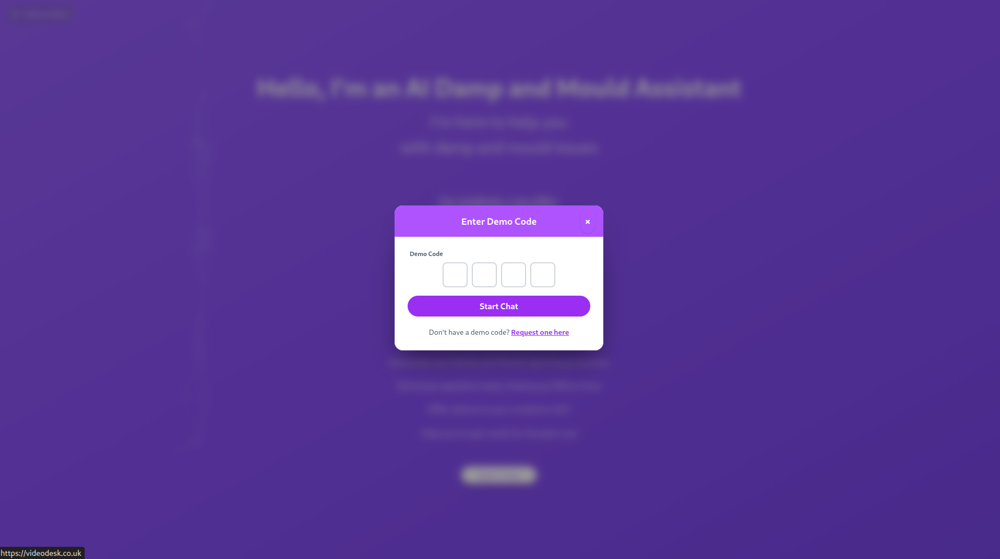

<small>*Demo Code Access Interface, where users can enter demo codes to access the AI analyser features*</small>
**Purpose**: Controlled access to analyser features
**Features**:
- **Code Validation**: Secure demo code verification
- **Session Management**: Time-limited access
- **Usage Tracking**: Analytics and monitoring
- **Feature Gating**: Controlled feature access

## Dashboard Features

### 1. Super Admin Dashboard
**Location**: `/dashboard/superadmin`

**Sections**:
- **Overview**: System-wide statistics and metrics
- **User Management**: Complete user lifecycle management
- **Company Management**: Multi-tenant company oversight
- **Support Tickets**: Centralized ticket management
- **Analyser History**: AI analyser usage tracking
- **System Monitoring**: Real-time system health

**Key Metrics**:
- Total users, companies, active sessions
- System performance indicators
- Feature usage statistics
- Revenue and subscription metrics

### 2. Company Admin Dashboard
**Location**: `/dashboard/companyadmin`

**Sections**:
- **Overview**: Company-specific metrics
- **User Management**: Company user administration
- **Meeting Analytics**: Video call statistics
- **Storage Usage**: File upload and storage metrics
- **Activity History**: User activity tracking
- **Company Profile**: Company settings and information

### 3. Standard Dashboard
**Location**: `/dashboard`

**Features**:
- **Personal Analytics**: Individual user statistics
- **Recent Activity**: Latest actions and sessions
- **Quick Actions**: Fast access to common features
- **Notifications**: System and support notifications

## File Upload & Sharing

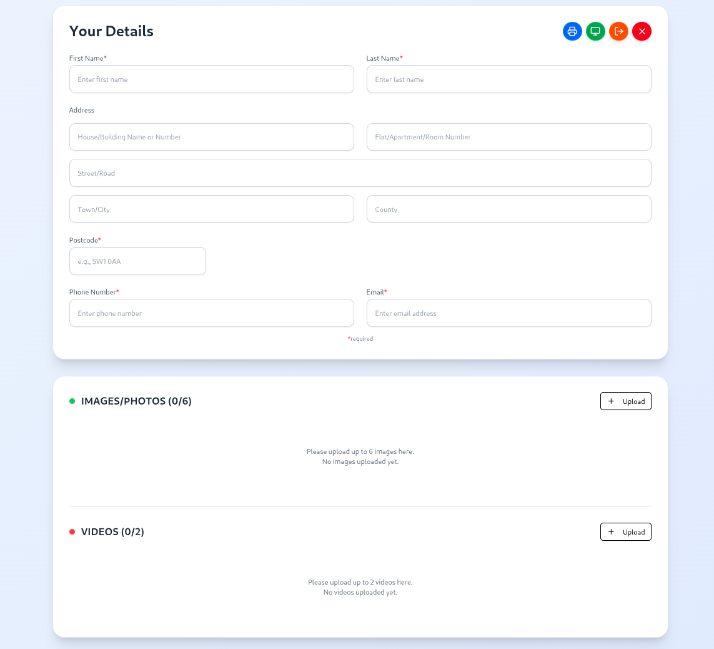

<small>*File Upload Interface, where residents upload property images, videos and information, then receive an access code to share with landlords*</small>

### 1. Multi-Media Upload System
**Supported Formats**:
- **Images**: JPEG, PNG, WebP (max 6 images)
- **Videos**: MP4, WebM, MOV (max 2 videos, 15 seconds each)
- **File Size Limits**: 10MB per file

**Code Implementation**:

```javascript
// File upload with validation
const handleFileUpload = async (files) => {
  const validFiles = files.filter(file => file.size < 10 * 1024 * 1024);
  return await Promise.all(
    validFiles.map(async file => ({
      ...file,
      data: await fileToBase64(file)
    }))
  );
};

// Base64 conversion
const fileToBase64 = (file) => {
  return new Promise((resolve, reject) => {
    const reader = new FileReader();
    reader.onload = () => resolve(reader.result);
    reader.onerror = reject;
    reader.readAsDataURL(file);
  });
};
```

### 2. Upload Process
**Steps**:
1. **Form Completion**: User details and property information
2. **File Selection**: Multi-file selection with validation
3. **Base64 Conversion**: Client-side file processing
4. **Session Creation**: Server-side upload session management
5. **Progressive Upload**: Sequential file upload with progress tracking
6. **Access Code Generation**: Unique code for content sharing

### 3. Access Code Features
**Functionality**:
- **URL Parameters**: Automatic code population from URLs
- **Time-Limited Access**: 15-minute timeout for guests
- **Role-Based Permissions**: Different access levels
- **Content Association**: Direct linking to specific uploads

### 4. File Management
**Features**:
- **Cloud Storage**: S3-compatible storage integration
- **Metadata Tracking**: File information and associations
- **Duplicate Detection**: Hash-based duplicate prevention
- **Progress Monitoring**: Real-time upload progress
- **Error Handling**: Comprehensive error management

## Chat & Messaging System

### 1. Real-Time Chat
**Technology**: Socket.IO WebSocket connections
**Features**:
- **Instant Messaging**: Real-time message delivery
- **Media Sharing**: Image and file sharing in chat
- **Message History**: Persistent chat history
- **Typing Indicators**: Real-time typing status
- **Connection Management**: Automatic reconnection

**Code Implementation**:

```javascript
// Chat socket connection
const useChatSocket = (ticketId) => {
  const [socket, setSocket] = useState(null);
  const [messages, setMessages] = useState([]);
  const [isConnected, setIsConnected] = useState(false);

  useEffect(() => {
    const socketRef = io(process.env.NEXT_PUBLIC_SOCKET_URL);
    
    socketRef.emit('join-ticket-chat', { ticketId, userId: user._id });
    
    socketRef.on('ticket-message', (message) => {
      setMessages(prev => [...prev, message]);
    });
    
    socketRef.on('connect', () => setIsConnected(true));
    socketRef.on('disconnect', () => setIsConnected(false));
    
    setSocket(socketRef);
    return () => socketRef.disconnect();
  }, [ticketId, user._id]);

  const sendMessage = (message) => {
    if (socket && isConnected) {
      socket.emit('send-ticket-message', {
        ticketId,
        message,
        senderId: user._id,
        senderEmail: user.email
      });
    }
  };

  return { socket, messages, isConnected, sendMessage };
};
```

## Support & Feedback System

### 1. Support Ticket Management

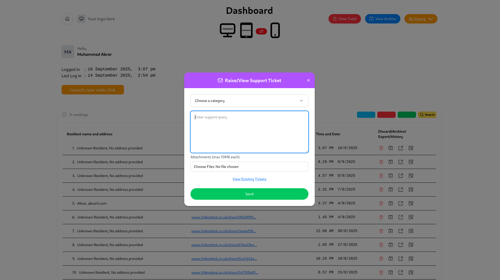

<small>*Support Ticket Management Interface, where users can create and manage support requests*</small>
**Features**:
- **Ticket Creation**: Multi-category ticket submission
- **File Attachments**: Support document uploads
- **Priority Levels**: Low, Medium, High, Critical
- **Status Tracking**: Open, In Progress, Resolved, Closed
- **Assignment System**: Ticket assignment to support staff

**Categories**:
- Technical Issues
- Account Problems
- Feature Requests
- Billing Inquiries
- General Support

### 2. Feedback System

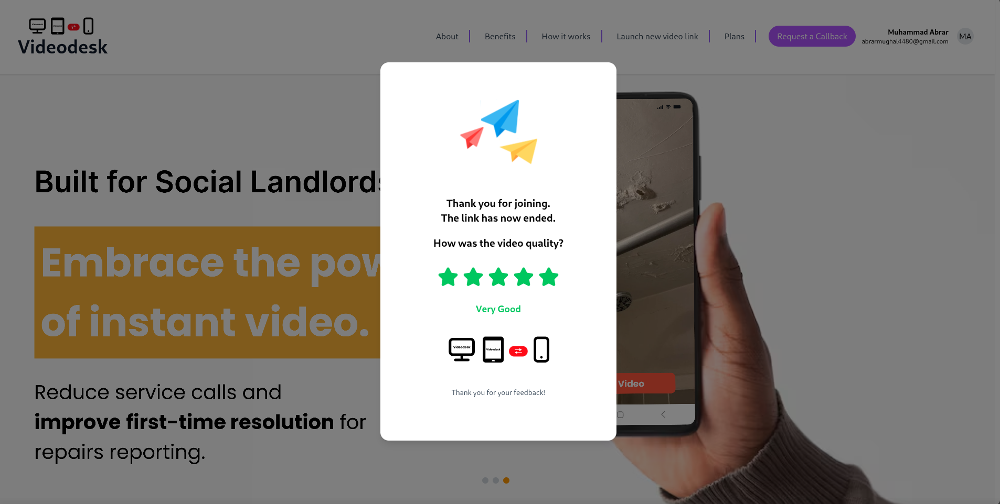

<small>*Feedback Collection Interface, where users can provide feedback and rate their experience*</small>
**Types**:
- **Session Feedback**: Post-call feedback collection
- **Feature Feedback**: Specific feature ratings
- **General Feedback**: Overall platform feedback
- **Bug Reports**: Issue reporting and tracking

### 3. Notification System
**Channels**:
- **In-App Notifications**: Real-time platform notifications
- **Email Notifications**: Email alerts and updates
- **Push Notifications**: Mobile push notifications
- **System Alerts**: Critical system notifications

## Advanced Features

### 1. Global Socket Tracking
**Technology**: Socket.IO with connection management
**Purpose**: System-wide real-time communication monitoring

**Features**:
- **Connection Monitoring**: Real-time socket connection status
- **Auto-reconnection**: Automatic connection recovery
- **Multi-socket Management**: Handle multiple socket connections
- **Connection Health**: Monitor connection quality and stability
- **Error Handling**: Comprehensive connection error management

### 2. Mobile Device Optimization
**Technology**: Responsive design with touch optimization
**Purpose**: Enhanced mobile user experience

**Features**:
- **Touch Controls**: Mobile-optimized touch interfaces
- **Responsive Design**: Adaptive layouts for all screen sizes
- **Mobile Camera**: Optimized mobile camera controls
- **Touch Drawing**: Touch-based drawing and annotation
- **Mobile Notifications**: Push notification support
- **Offline Capabilities**: Limited offline functionality

### 3. Session Management & Analytics
**Technology**: Custom session tracking with analytics
**Purpose**: Comprehensive session monitoring and reporting

**Features**:
- **Session Duration**: Track call length and engagement
- **User Activity**: Monitor user interactions and actions
- **Performance Metrics**: Connection quality and performance data
- **Usage Statistics**: Feature usage and adoption tracking
- **Error Logging**: Comprehensive error tracking and reporting
- **Session Recording**: Optional session recording capabilities

### 4. Security & Privacy Features
**Technology**: JWT authentication with data encryption
**Purpose**: Secure data handling and user privacy protection

**Features**:
- **Data Encryption**: End-to-end data encryption
- **Secure File Upload**: Encrypted file transfer
- **Access Control**: Role-based access restrictions
- **Session Security**: Secure session management
- **Data Privacy**: GDPR-compliant data handling
- **Audit Logging**: Comprehensive activity logging

### 5. Integration Capabilities
**Technology**: RESTful APIs with webhook support
**Purpose**: Third-party system integration and automation

**Features**:
- **REST API**: Comprehensive REST API endpoints
- **Webhook Support**: Real-time event notifications
- **Third-party Integration**: External system connectivity
- **Data Export**: Multiple export formats (JSON, CSV, PDF)
- **Custom Integrations**: Flexible integration options
- **API Documentation**: Complete API documentation

## Technical Architecture

### 1. Frontend Technology Stack
- **Framework**: Next.js 14 with App Router
- **UI Library**: React with custom components
- **Styling**: Tailwind CSS
- **State Management**: React Context API
- **Real-time Communication**: Socket.IO client
- **WebRTC**: Native WebRTC APIs

### 2. Backend Technology Stack
- **Runtime**: Node.js
- **Framework**: Express.js
- **Database**: MongoDB with Mongoose ODM
- **Real-time**: Socket.IO server
- **File Storage**: S3-compatible storage
- **AI Integration**: OpenAI API

### 3. Key Dependencies
**Frontend**:
- `socket.io-client`: WebSocket communication
- `lucide-react`: Icon library
- `sonner`: Toast notifications
- `moment`: Date/time handling

**Backend**:
- `express`: Web framework
- `mongoose`: MongoDB ODM
- `socket.io`: WebSocket server
- `multer`: File upload handling
- `openai`: AI integration

### 4. Security Features
- **Authentication**: JWT-based authentication
- **Authorization**: Role-based access control
- **Data Validation**: Input sanitization and validation
- **File Security**: Secure file upload and storage
- **API Protection**: Rate limiting and CORS configuration

### 5. Performance Optimizations
- **Image Optimization**: Automatic image compression
- **Lazy Loading**: Component and image lazy loading
- **Caching**: Browser and server-side caching
- **Code Splitting**: Dynamic imports and route-based splitting
- **WebRTC Optimization**: Efficient peer connection management

## API Endpoints

### 1. Authentication
- `POST /api/v1/auth/login` - User login
- `POST /api/v1/auth/register` - User registration
- `POST /api/v1/auth/logout` - User logout
- `GET /api/v1/auth/me` - Get current user

### 2. WebRTC
- `POST /api/v1/webrtc/create-room` - Create video room
- `GET /api/v1/webrtc/room/:id` - Get room details
- `DELETE /api/v1/webrtc/room/:id` - Delete room

### 3. File Upload
- `POST /api/v1/upload/session` - Create upload session
- `POST /api/v1/upload/file/:sessionId` - Upload file
- `POST /api/v1/upload/complete/:sessionId` - Complete upload

### 4. AI Analyser
- `POST /api/v1/analyze` - Analyse image for damp/mould
- `GET /api/v1/analyze/history` - Get analysis history

### 5. Support
- `POST /api/v1/support-tickets/create` - Create support ticket
- `GET /api/v1/support-tickets` - Get user tickets
- `PUT /api/v1/support-tickets/:id` - Update ticket

## Deployment & Configuration

### 1. Environment Variables
**Frontend**:
- `NEXT_PUBLIC_BACKEND_URL`: Backend API URL
- `NEXT_PUBLIC_SOCKET_URL`: WebSocket server URL

**Backend**:
- `MONGODB_URI`: Database connection string
- `JWT_SECRET`: JWT signing secret
- `OPENAI_API_KEY`: OpenAI API key
- `AWS_ACCESS_KEY_ID`: S3 storage access key
- `AWS_SECRET_ACCESS_KEY`: S3 storage secret key

### 2. Production Considerations
- **HTTPS Required**: WebRTC requires secure context
- **STUN/TURN Servers**: Configure for NAT traversal
- **CDN Integration**: Static asset delivery
- **Monitoring**: Application performance monitoring
- **Backup Strategy**: Database and file backup procedures

## Future Enhancements

### 1. Planned Features
- **Mobile App**: Native iOS and Android applications
- **Advanced Analytics**: Machine learning insights
- **Integration APIs**: Third-party system integration
- **Multi-language Support**: Internationalization
- **Advanced AI**: Enhanced computer vision capabilities

### 2. Scalability Improvements
- **Microservices Architecture**: Service decomposition
- **Load Balancing**: Horizontal scaling
- **Database Sharding**: Data distribution
- **Caching Layer**: Redis integration
- **CDN Optimization**: Global content delivery

## AI Chat Bot Integration

### 1. D&M AI Chat Interface

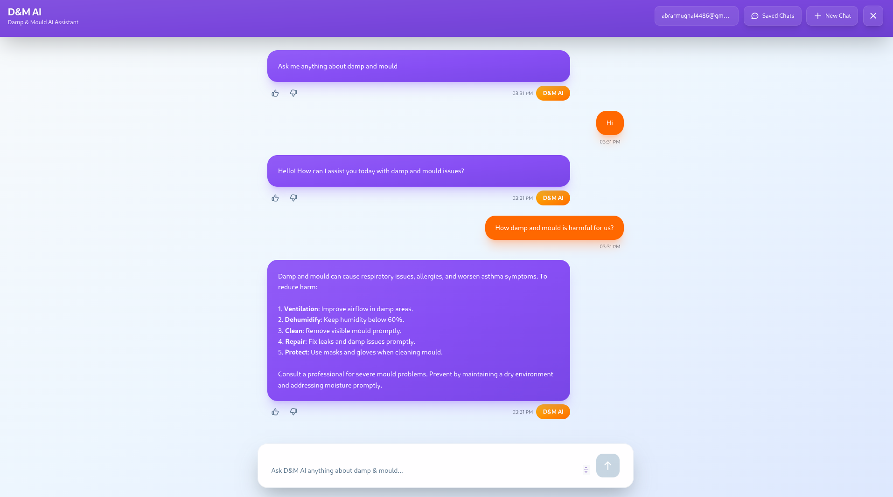

<small>*AI Chat Interface (Karla), where users can chat with an AI assistant specialized in damp and mould analysis*</small>
**Purpose**: AI-powered customer support
**Features**:
- **Damp & Mould Expertise**: Specialized knowledge base
- **Session Management**: Persistent chat sessions
- **Feedback System**: Message rating and feedback
- **Local Storage**: Offline chat history
- **Backend Sync**: Cloud synchronization for authenticated users

### 2. Admin Chat Screen
**Purpose**: Support ticket communication
**Features**:
- **Ticket Integration**: Direct ticket association
- **Media Support**: File and image sharing
- **Message Export**: Chat history export functionality
- **Status Tracking**: Message read/unread status
- **Search Functionality**: Message search and filtering


---

*This documentation provides a comprehensive overview of the VideoDesk platform's features, capabilities, and technical implementation. For specific implementation details or troubleshooting, refer to the individual component documentation or contact the development team.*
