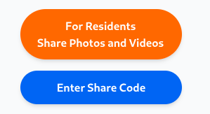
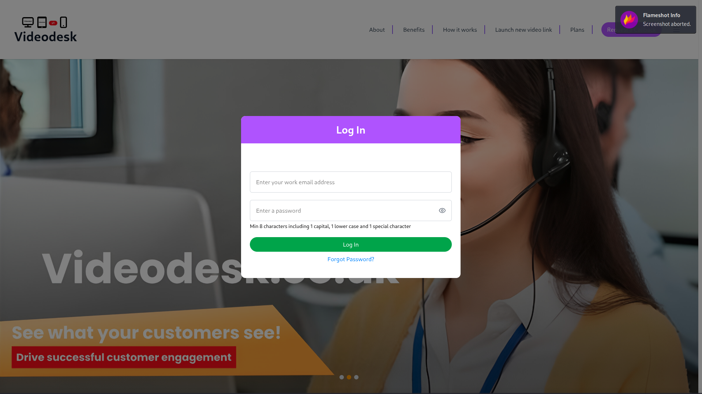
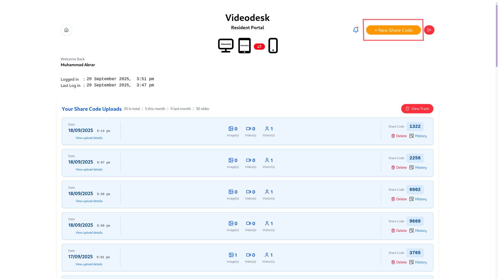
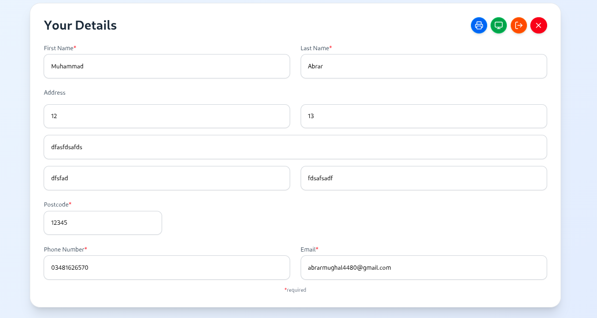
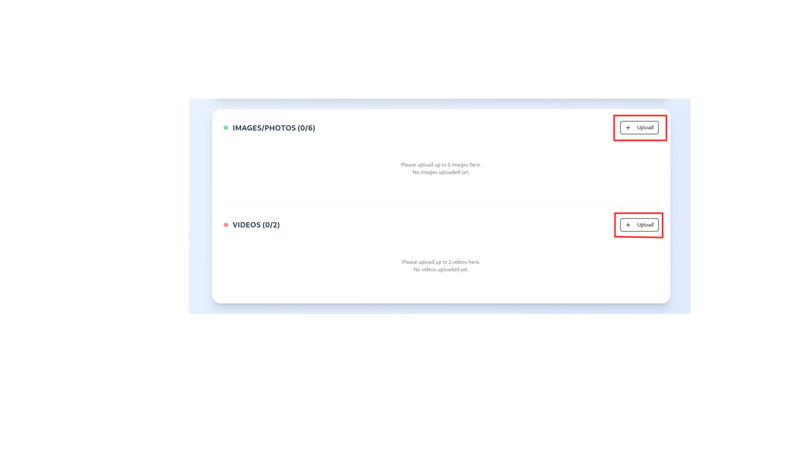
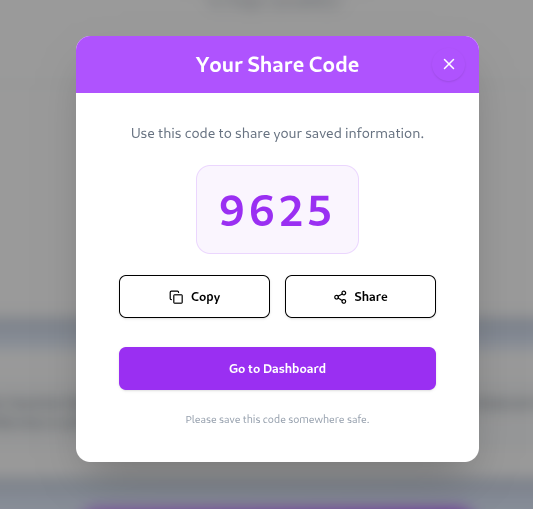
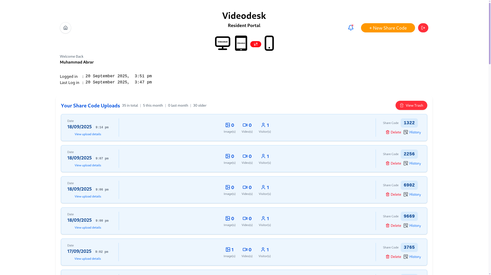
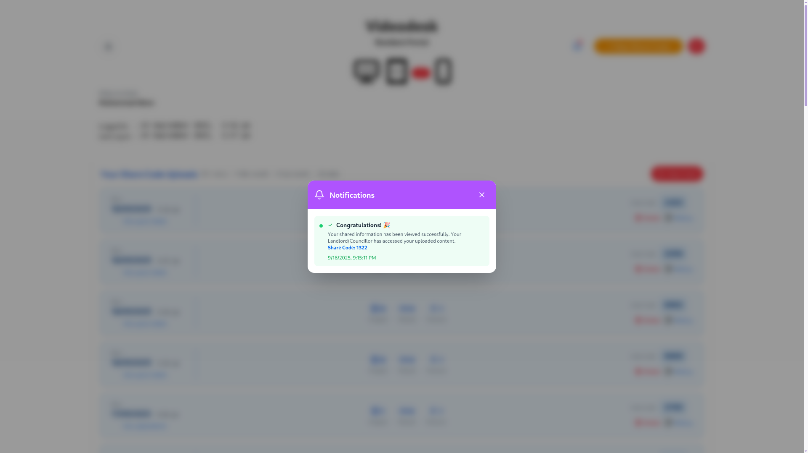

# VideoDesk Resident User Manual

## Table of Contents

1. [Getting Started](#1-getting-started)
   - 1.1 [What is VideoDesk?](#11-what-is-videodesk)
   - 1.2 [Accessing the Platform](#12-accessing-the-platform)
   - 1.3 [How to Get Started](#13-how-to-get-started)
   - 1.4 [For Existing Users](#14-for-existing-users)

2. [File Upload & Access Code Generation](#2-file-upload--access-code-generation)
   - 2.1 [Step-by-Step Upload Process](#21-step-by-step-upload-process)
   - 2.2 [Access Code Features](#22-access-code-features)

3. [Dashboard Features](#3-dashboard-features)
   - 3.1 [Resident Dashboard Overview](#31-resident-dashboard-overview)
   - 3.2 [Notification System](#32-notification-system)

4. [Troubleshooting](#4-troubleshooting)
   - 4.1 [Common Issues and Solutions](#41-common-issues-and-solutions)
   - 4.2 [Getting Help](#42-getting-help)
   - 4.3 [Best Practices](#43-best-practices)

---

## 1. Getting Started

### 1.1 What is VideoDesk?

VideoDesk is a comprehensive platform designed for property management that allows residents to:

- Upload property image/photo and videos
- Generate secure access codes for sharing content
- Access their personal dashboard
- Manage their property content

### 1.2 Accessing the Platform

### 1.3 How to Get Started

• **Visit the Website**: Go to the VideoDesk homepage

• **Footer Button**: Scroll down to the footer and click the "For Residents Share Photos and Videos" button

*Image 1: VideoDesk Homepage with two main buttons at footer - orange 'For Residents Share Photos and Videos' button and blue 'Enter Share Code' button*

• **Upload Form**: Fill out the property information and upload your image/photo/videos

• **Submit**: Submit the form with your details

• **Password Creation**: The system will ask you to create a password for your account

• **Account Created**: Your resident account is automatically created with your password

• **Dashboard Access**: You're now logged in and can access your resident dashboard

### 1.4 For Existing Users

• **Login**: Use your existing credentials to login from the home page

*Image 2: Login Popup on Homepage, where existing users can enter their credentials to access their account*

• **Pre-filled Form**: If you're already logged in, the upload form will be automatically pre-filled with your account information

• **Dashboard**: Access all your resident features and upload history

---

## 2. File Upload & Access Code Generation

### 2.1 Step-by-Step Upload Process

• **Starting a New Upload**: Click the "+ New Share Code" button on your dashboard

*Image 3: Resident Dashboard showing user profile and orange '+ New Share Code' button in top right corner along with bell notification icon*

This will take you to the upload page

• **Filling Out Property Information**:

*Image 4: File Upload Page, where residents fill out property information and upload their images and videos*

• **Adding Media Files**:

**Image Upload:**
- **Maximum**: 6 image/photo
- **Supported formats**: JPEG, PNG, WebP
- **File size limit**: 10MB per image
- **How to add**: Click the image upload area and select files
- **Labeling**: Add descriptive labels for each image

**Video Upload:**
- **Maximum**: 2 videos
- **Duration limit**: 15 seconds per video
- **Supported formats**: MP4, WebM, MOV
- **File size limit**: 10MB per video
- **How to add**: Click the video upload area and select files
- **Labeling**: Add descriptive labels for each video

*Image 5: Image and Video Upload Section on Upload Page, showing specific areas where users can drag and drop or select their media files*

• **Submitting Your Upload**:
  1. **Review**: Check all information is correct
  2. **Submit**: Click the submit button
  3. **Progress Tracking**: Watch the upload progress bar
  4. **Access Code**: Receive your unique 4-digit access code

• **Sharing Your Content**:
  - **Access Code**: Use the generated 4-digit code
  - **Share URL**: Send the access code to your landlord
  - **Time Limit**: Access codes are valid for 15 minutes for guest users
  - **Notifications**: You'll receive notifications when someone views your content

### 2.2 Access Code Features

*Image 6: Share Code display showing the generated 4-digit access code*

- **Unique Generation**: Each upload gets a unique 4-digit code
- **Secure Sharing**: Only people with the code can access your content
- **Time-Limited Access**: Guest users have 15-minute access
- **Real-time Notifications**: Get notified when your content is viewed

---

## 3. Dashboard Features

### 3.1 Resident Dashboard Overview

**Location**: Available at `/dashboard` after login

*Image 7: Resident Dashboard Interface, showing all available features and navigation options for residents*

Your dashboard provides access to all resident features:

• **Main Features**:
  - **New Share Code**: Create new uploads and access codes
  - **Notifications**: Real-time alerts when your content is viewed

    
    *Image 8: Notification Popup that opens when clicking the bell icon on dashboard, showing real-time alerts and notifications*
  - **Recent Activity**: View your latest uploads and activities
  - **Quick Access**: Fast access to all platform features

• **Navigation**:
  - **Upload Content**: Access the file upload system from dashboard
  - **Dashboard**: Manage your account and view activity

### 3.2 Notification System

• **Real-time Alerts**: Instant notifications when content is accessed

• **Bell Icon**: Click the notification bell to view alerts

• **Toast Notifications**: Pop-up notifications for immediate attention

• **History**: View all past notifications

---

## 4. Troubleshooting

### 4.1 Common Issues and Solutions

• **Upload Problems**:
  **Issue**: Files not uploading
  - **Solution**: Check file size (max 10MB) and format (JPEG, PNG, WebP for image/photo; MP4, WebM, MOV for videos)
  - **Solution**: Ensure stable internet connection

  **Issue**: Upload progress stuck
  - **Solution**: Refresh the page and try again
  - **Solution**: Check if files are within size limits

• **Access Code Issues**:
  **Issue**: Access code not working
  - **Solution**: Ensure the code is exactly 4 digits
  - **Solution**: Check if the code has expired (15-minute limit for guests)
  - **Solution**: Verify you're using the correct code

### 4.2 Getting Help

• **Support Tickets**: Create support tickets for technical issues

• **Contact Support**: Reach out through the support system

• **Video Guides**: Access how-to video guides from the dashboard

### 4.3 Best Practices

• **Image Quality**: Use clear, well-lit photos for best results

• **File Organisation**: Label your uploads clearly for easy identification

• **Regular Updates**: Keep your contact information up to date

• **Internet Connection**: Ensure stable connection for uploads

• **Browser Compatibility**: Use modern browsers (Chrome, Firefox, Safari, Edge)
